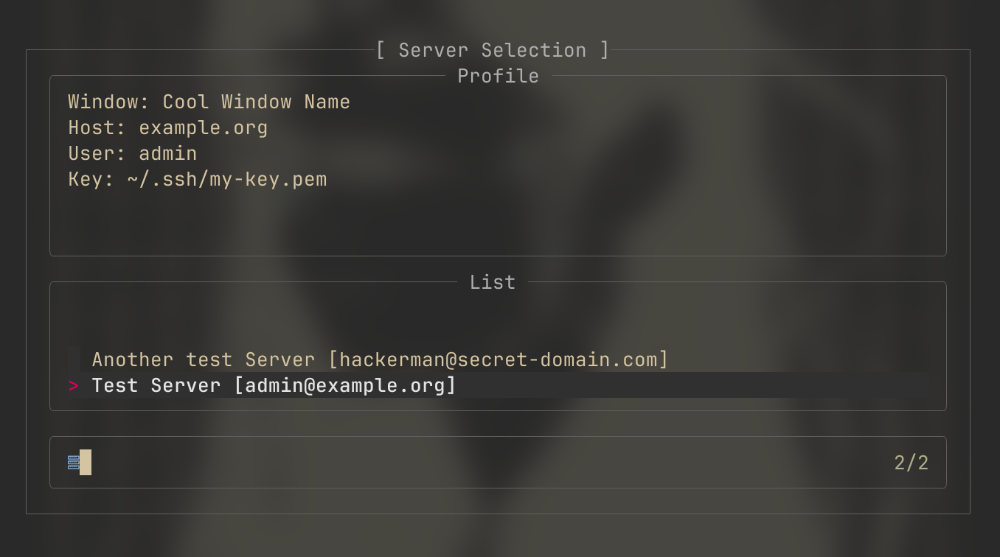

# Tmux SSH-Picker


An over-engineered approach to me being to lazy to type out ssh commands.
The plugin was heavily inspired by

and his tmux plugin




## Notice

I am still in the process of learning how to write shell scripts.
Currently, the plugin is as bare-bone as it can be.
My plan is to implement additional features as I continue to learn about `sh`.

## Prerequisites

- [tpm](https://github.com/tmux-plugins/tpm)
- [fzf](https://github.com/junegunn/fzf)
- [yq](https://github.com/mikefarah/yq)
- [jq](https://github.com/jqlang/jq)

## Install

Add this to your `.tmux.conf` and run `Ctrl-I` for tpm to install the plugin.

```conf
set -g @plugin 'robertbradl/tmux-ssh-picker'
```

## Define connections

Inside your `tmux` directory, make a file called `profiles.yaml`,
it will store all your connections.

```bash
touch $HOME/.config/tmux/profiles.yaml # Directory might be different for your system!
```

After that, you can set up a connection like so:

```yaml
- label: "Test label"
  window: "Window name"
  user: "admin"
  host: "example.org"
  key: "path/to/your/shh-key.pem"
```

## How it works

The plugin uses `yq` and `jq` to pass all profiles into `fzf`.
After you make a selection, a `ssh` command gets constructed
and `tmux` then creates a new window where it runs the `ssh` command in.
